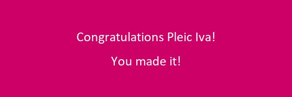

# Symmetric key cryptography

## Princip rada simetrične kriptografije:
<br />


<br />
<br />

## Cilj vježbe:
 Trebalo je otkriti koji je naš enkriptirani dokument, pronaći ključ te pomoću njega dekriptirati spomenuti dokument. Nismo imali pristup enkripcijskom ključu, no na kraju smo uspjeli doći do rezultata - **slika u png formatu s personaliziranom porukom**.
<br />
<br />

# Opis vježbe 

Ušli smo na link http://challenges.local/ gdje su nas čekale enkriptirane datoteke čiji su nazivi enkriptirani, ali to su bila naša imena i prezimena. Pomoću funkcije ispod trebali smo saznati hash vrijednost datoteke u kojoj se nalazi naš personalizirani plaintext.Plaintext koji student treba otkriti enkriptiran je korištenjem high-level sustava za simetričnu enkripciju iz navedene biblioteke - **Fernet**.

```
from cryptography.hazmat.primitives import hashes

def hash(input):
    if not isinstance(input, bytes):
        input = input.encode()

    digest = hashes.Hash(hashes.SHA256())
    digest.update(input)
    hash = digest.finalize()

    return hash.hex()

filename = hash('pleic_iva') + ".encrypted"

print(filename)
```
Kada smo otkrili datotetku preuzeli smo je i spremili u folder koji smo kreirali u kojem će biti Python skripte za ekripciju ovog ciphertexta.

Naša datoteka je bila enkriptirana ključem entropije - **22 bita** što znači da ukupno postoji **2^22** kombinacija ključeva.S obzirom da se radi o relativno malom broju koristit ćemo **Brute force napad**.

Glavna ideja je bila da kroz while petlju iteracijom provjerimo sve moguće ključeve.Profesor nam je tijekom vježbe rekao da je enkriptirani podatak **slika**, točnije datoteka png formata što je bilo od velike važnosti.Znali smo što je ciphertext,ali nismo znali ni plaintext ni ključ.Do plaintexta smo došli **trial-and-error** (probaj dok ne uspije) metodom.
Varijabli ciphertext smo pridružili vrijednost naše enkriptirane datoteke pomoću sljedećeg bloka koda koji služi za učitavanje datoteka u Pythonu:

<br/>

```
with open(filename, "rb") as file:
    ciphertext = file.read()
```
Unutar while petlje smo prilikom svake iteracije pomoću trenutnog ključa **k** pokušali dekripcijskim algoritmom dekriptirati ciphertext te bismo tu vrijednost pridružili varijabli **plaintext**.

Nakon što bismo dobili plaintext za trenutnu iteraciju pozvali bismo funkciju **test_png**.U funkciju test_png slali bismo header - **prva 32 bita plaintext-a**.

```
def test_png(header):
    if header.startswith(b"\211PNG\r\n\032\n"):
        return True
    return False
```

Unutar funkcije test_png smo provjeravali odgovara li naša varijabla header (string) header-u datoteka png formata. Ukoliko bi bilo poklapanja, funkcija bi vratila istinu i došlo bi do pucanja while petlje. Na ovaj način smo znali i koji je naš **plaintext** i koji je **ključ**.

Jedino što nam je još preostalo bilo je spremiti naš plaintext u obliku datoteke.

To smo učinili pomoću idućeg bloka koda koji služi za spremanje datoteka u Pythonu:

<br/>

```
with open(filename, "wb") as file:
    file.write(plaintext)
```

Programu je trebalo malo duže vremena da se izvrti zato što smo prilikom svake iteracije imali dekripciju. Međutim, kada bi se program uspješno izvršio, unutar direktorija u kojem se nalazila Python skripta bi se također stvorila i naša dekriptirana datoteka (plaintext).

**Rezultat (plaintext)**:


