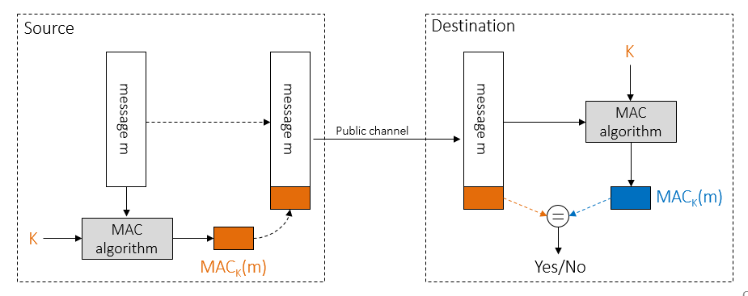

# Lab 4: Message authentication and integrity

## PRINCIP RADA MAC ALGORITMA :



Da bismo stvorili **MAC** potrebni su nam **poruka** koju namjeravamo poslat te **ključ**. Python ima biblioteke koje sadrže funkcije za stvaranje MAC-a. Glavna ideja je da funkciji koja stvara MAC kao argumente pošaljemo **poruku** i **ključ**. Funkcija nam vrati generirani **MAC**. Mi kao izvorište poruku zajedno s MAC-om šaljemo odredištu.

Kada odredište primi poruku i MAC, poruku "provuče" kroz isti **MAC algoritam** koristeći **isti ključ (simetrična enkripcija)**.

Odredište ovime kreira lokalno MAC kojeg će **usporediti** s onim kojeg smo mi, kao izvorište, poslali.

Ukoliko nisu jednaki, odredište će znati da je poruka najvjerojatnije mijenjana te je time **narušen integritet** poruke.

## 1. zadatak

U ovom primjeru smo pokazali kako se generira MAC za neku određenu poruku uz pomoć ključa te kako ćemo provjeriti je li očuvan integritet te iste poruke.

Prvo smo razmislili koji je cilj naše vježbe te zapisali korake rješavanja problema :

```
1. Sign the file content
	1.1. Read the file content
	1.2. Sign the content
	1.3. Save the signature into a file
2. Verify message authenticity
	2.1. Read the recieved file
	2.2. Read the recieved signature
	  2.3.1. Sign the recieved file
		2.3.2. Compare locally generated signature with the recieved one
```

**1.1** Za početak smo kreirali **tekstualnu datoteku (***message.txt***)** i u nju napisali poruku koju želimo zaštititi. Sadržaj poruke smo pohranili u varijablu (*message***)** :

```python
with open(filename, "rb") as file:
     message = file.read()
```

**1.2** Pomoću varijable u koju smo pohranili poruku generirali smo MAC. Za generiranje MAC-a smo koristili funkciju ***generate_MAC*** kojoj smo proslijedili poruku i ključ***:***

```python
from cryptography.hazmat.primitives import hashes, hmac

def generate_MAC(key, message):
    if not isinstance(message, bytes):
        message = message.encode()

    h = hmac.HMAC(key, hashes.SHA256())
    h.update(message)
    signature = h.finalize()
    return signature
```

**1.3** Kada smo dobili **MAC** spremili smo ga u zasebnu datoteku (*message.sig*):

```python
with open("message.sig", "wb") as file:
      file.write(signature)
```

**2.1** Pročitali smo datoteku u kojoj se nalazi dobivena poruka.

**2.2** Pročitali smo datoteku u kojoj se nalazi dobiveni MAC.

**2.3** Pomoću funkcije ***generate_MAC*** smo lokalno na odredištu izračunali MAC. U funkciju smo proslijedili poruku i ključ.

**2.4** Pomoću funkcije ***verify_MAC** (njoj smo proslijedili poruku, ključ i MAC)* smo usporedili dobiveni i lokalno izračunati MAC. Ako su jednaki funkcija vraća istinu, a u suprotnom neistinu.

```python
from cryptography.hazmat.primitives import hashes, hmac
from cryptography.exceptions import InvalidSignature

def verify_MAC(key, signature, message):
    if not isinstance(message, bytes):
        message = message.encode()

    h = hmac.HMAC(key, hashes.SHA256())
    h.update(message)
    try:
        h.verify(signature)
    except InvalidSignature:
        return False
    else:
        return True
```

Testirali smo funkcije tako što smo mijenjali sadržaj poruke te pokazali na koji način se MAC mehanizam brine o autentičnosti poruke.

## 2. zadatak

U 2. zadatku bilo je potrebno utvrditi vremenski ispravan redoslijed transakcija dionicama.

Na ****lokalnom serveru ****su se nalazili direktoriji s našim imenima. Unutar svakog direktorija se nalazilo 10 poruka i 10 MAC-ova. Trebali smo te datoteke preuzeti u naš direktorij na računalu te smo koristili program **wget.**

```python
wget -r -nH -np --reject "index.html*" http://challenges.local/challenges/gr3/pleic_iva/mac_challenge/
```

Naš zadatak je bio učitati 20 tekstualnih datoteka (10 poruka i 10 MAC-ova), a zatim provjeriti je li narušen integritet poruke. Na izlazu je bilo potrebno ispisati sadržaj poruke te poklapa li se naš generirani MAC za određenu poruku s MAC-om kojeg smo učitali iz tekstualne datoteke.

Za provjeru MAC-a potreban je ključ koji je dobiven iz našeg imena i prezimena.

**key = "<prezime_ime>".encode()**

S obzirom da se naše tekstualne datoteke nisu pohranile u istom direktoriju gdje je bila pohranjena skripta, bilo je potrebno kreirati ***path*** do potrebnog direktorija.

Unutar *for* petlje smo, za svaki par, pohranili poruku i MAC u varijable *message* i *signature*. Pozivom funkcije ***verify_MAC*** smo provjerili autentičnost poruke te na izlazu ispisali njen sadržaj i OK/NOK (*true/false*).

```python
for ctr in range(1, 11):
        msg_filename = f"order_{ctr}.txt"
        sig_filename = f"order_{ctr}.sig"

        msg_file_path = Path(PATH + msg_filename)
        with open(msg_file_path, "rb") as file:
            message = file.read()

        sig_file_path = Path(PATH + sig_filename)
        with open(sig_file_path, "rb") as file:
            signature = file.read()

        is_authentic = verify_MAC(
            key=KEY, signature=signature, message=message)
       # print(
        # f'Message {message.decode():>45} {"OK" if is_authentic else "NOK":<6}')
        if is_authentic:
            authentic_messages.append(message.decode())
```

Sve autentične poruke smo **vremenski sortirane** pohranili u niz **authentic_messages.** U terminalu smo ispisali sve autentične poruke vremenski sortirane.

```python
authentic_messages.sort(key=lambda m: datetime.datetime.fromisoformat(
        re.findall(r'\(.*?\)', m)[0][1:-1]))

    for m in authentic_messages:
        print(f'Message {m:>45} {"OK":<6}')
```