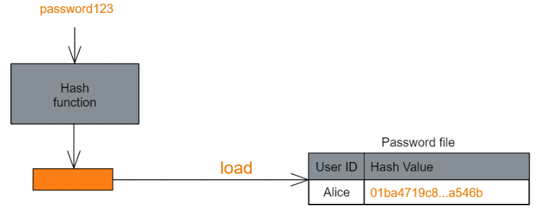
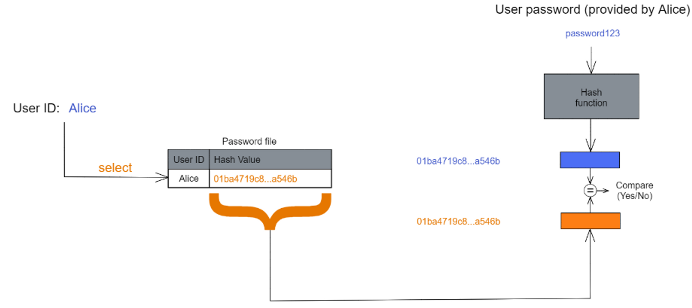

# Lab 5 izvještaj (Password-hashing)

### Ilustracija principa spremanja lozinke u bazu podataka :



### Princip verifikacije lozinke :



Prilikom registracije korisnik unosi svoje korisničko ime i lozinku po prvi put. Korisničko ime mora biti jedinstveno. Ta dva podatka se spremaju u bazu, korisničko ime kao **plaintext**, zaporka se ne sprema kao plaintext već se sprema **hash value** same zaporke. Prilikom prijave unosi se korisničko ime i lozinka te slijedi postupak verifikacije. Server hashira unesenu zaporku te uspoređuje tu vrijednost sa vrijednosti u bazi podataka. Ukoliko su jednake, prijava je uspješna.

### VJEŽBA:

Tijekom vježbe smo imali 2 zadatka.

U prvom smo uspoređivali brzine kriptografskih funkcija, a u drugom smo **i**mplementirali jednostavan sustav autentikacije korisnika.

## **USPOREDBA BRZIH I SPORIH KRIPTOGRAFSKIH FUNKCIJA**

Za početak smo instalirali pakete potrebne za pokretanje koda. Potrebni paketi su se nalazili u datoteci requirements.txt. To smo izvršili korištenjem sljedeće naredbe:

```python
pip install -r requirements.txt
```

Koristili smo funkcije:

- AES
- HASH_SHA256
- HASH_MD5

Ispis programa je bio u obliku tablice iz koje smo mogli zaključiti da su ***hash* funkcije znatno brže od AES enkripcijskog algoritma**.

Međutim, u sigurnosti nam to nije uvijek najpogodnije. Jedan od čestih napada na ovakve sustave je **precomputed dictionary attack**. Rješenje bi bilo usporavanje kriptografske funkcije. *Hash* funkciju možemo usporiti primjenom **iterativne metode**. To može demotivirati napadača ukoliko predugo traje ili nema potrebne resurse CPU-a ili memorije.

### **Iterativna metoda**

Umjesto da lozinku ***p*** hashiramo jedanput i pohranimo *hash* vrijednost ***H(p)***, hashirat ćemo ***p*** iterativnih ***n*** puta te pohraniti ***H^n(p) = H(...H(H(p))...)***.

Ovaj proces se proces **ne može paralelizirati** zato što nam za svaku trenutnu *hash* vrijednost treba prethodna *hash* vrijednost. Na taj način se **vrijeme hashiranja povećava *n* puta**.

> Kod vježbe se nalazi u datoteci **pwd_hash.py** .
> 

## IMPLEMENTIRANJE JEDNOSTAVNOG SUSTAVA ZA AUTENTIKACIJU KORISNIKA

U ovom dijeli vježbe smo implementirali proces registracije i prijave korisnika korištenjem **Argon2** kriptografske funkcije.

Koristili smo bazu **SQLite** za pohranu korisnika. Korištenjem ekstenzije VS Code-a **SQLlite Viewer** smo imali uvid u našu bazu podataka.

Funkcija  **register_user()**  bi kreirala tablicu i u nju unijela korisničko ime i lozinku.

Iako su postojala 2 korisnika koji imaju istu lozinku, hash vrijednosti nisu bile jednake zbog **soli**.

Prije registracije korisnika potrebno je provjeriti je li korisničko ime već zauzeto.

**Dakle, zaporka ne mora biti jedinstvena, ali korisničko ime mora!**

Argon2 treba i zaporku i njenu hash vrijednost da bi izvršio usporedbu unesenih i točnih podataka. 

Tek nakon unosa i imena i zaporke, provjerava se valjanost podataka jer ako bi sustav tražio prvo username napadač bi mogao znati koja sve korisnička imena postoje u bazi. Ako unese krivu zaporku, a točno korisničko ime napadač nezna je li kriva zaporka ili korisničko ime. Iz tog razloga se traže oba podatka.

Važan element za Argon2 funkciju je sol koja se nalazi na kraju hash vrijednosti zaporke.